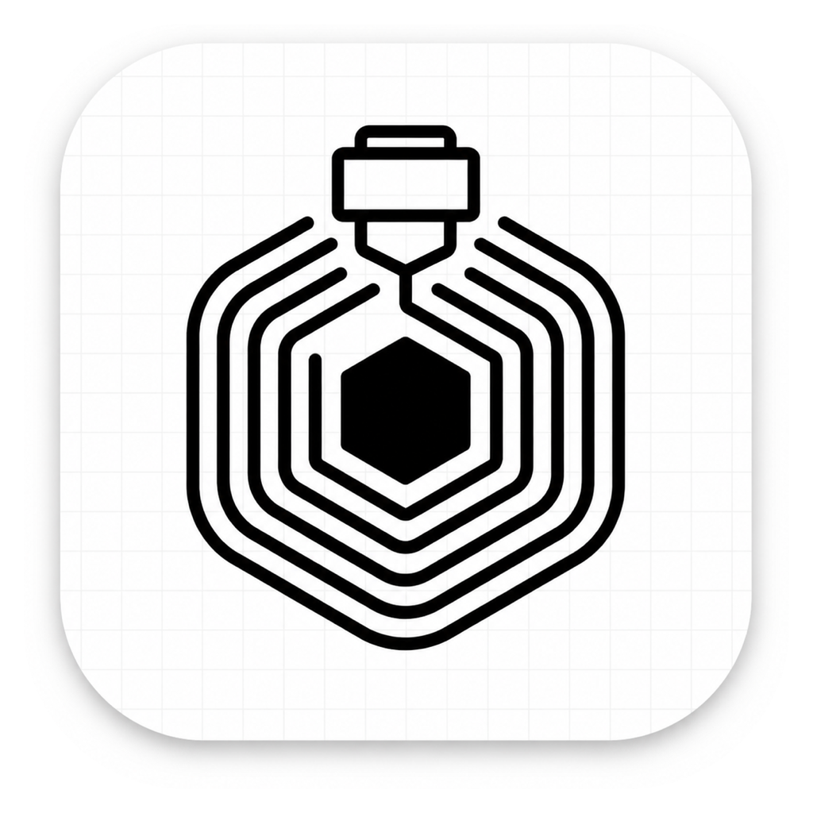
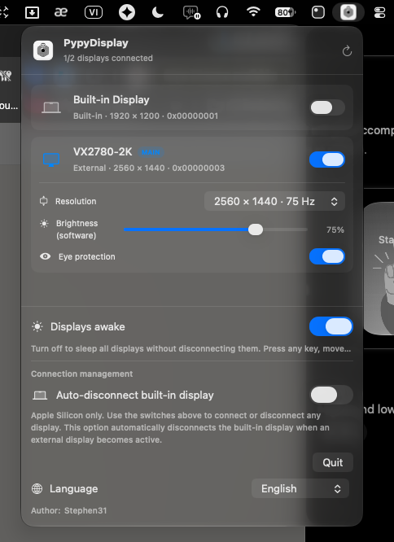

  

<h1 align="center">PypyDisplay</h1>

Ứng dụng menu bar tối giản để quản lý màn hình trên macOS.

A minimal macOS menu bar app for managing your displays.

<em>English below ↓</em>

  

<em>Giao diện PypyDisplay · PypyDisplay interface</em>

## Tiếng Việt

### Giới thiệu

PypyDisplay giúp bạn quản lý nhanh màn hình tích hợp và màn hình ngoài ngay trên thanh menu macOS.

### Tính năng

- Bật hoặc cho toàn bộ màn hình ngủ mà không thay đổi bố cục.
- Kết nối hoặc ngắt kết nối từng màn hình.
- Tự ngắt màn hình tích hợp khi kết nối màn hình ngoài.
- Thay đổi độ phân giải và độ sáng từng màn hình.
- Chế độ bảo vệ mắt riêng cho từng màn hình.
- Điều khiển True Tone cho màn hình tích hợp.
- Hỗ trợ tiếng Việt và tiếng Anh.
- Phím tắt toàn hệ thống: `⌃⌥⌘D`.

### Cài đặt

1. [Tải PypyDisplay.dmg](https://github.com/pypy-studio-universe/pypy-display/releases/latest/download/PypyDisplay-0.9.1-arm64.dmg).
2. Mở file DMG và kéo **PypyDisplay** vào **Applications**.
3. Mở ứng dụng và chọn **Open** nếu macOS yêu cầu xác nhận.

> Yêu cầu macOS 15 trở lên và máy Mac Apple Silicon. Tối ưu cho macOS 26.

### Lời cảm ơn

Cảm ơn bạn đã sử dụng và ủng hộ PypyDisplay.

Phát triển bởi **Stephen31 · PYPY STUDIO**.

---

## English

### Introduction

PypyDisplay lets you quickly manage built-in and external displays directly from the macOS menu bar.

### Features

- Sleep or wake all displays without changing the layout.
- Connect or disconnect individual displays.
- Automatically disconnect the built-in display when an external display is connected.
- Change resolution and brightness for each display.
- Per-display eye protection mode.
- True Tone control for the built-in display.
- English and Vietnamese support.
- Global shortcut: `⌃⌥⌘D`.

### Installation

1. [Download PypyDisplay.dmg](https://github.com/pypy-studio-universe/pypy-display/releases/latest/download/PypyDisplay-0.9.1-arm64.dmg).
2. Open the DMG and drag **PypyDisplay** into **Applications**.
3. Launch the app and select **Open** if macOS requests confirmation.

> Requires macOS 15 or later and an Apple Silicon Mac. Optimized for macOS 26.

### Thank You

Thank you for using and supporting PypyDisplay.

Developed by **Stephen31 · PYPY STUDIO**.

## Ủng hộ · Support

☕ [PayPal — Giúp tôi tiếp tục phát triển PypyDisplay · Help keep PypyDisplay growing](https://www.paypal.com/ncp/payment/JXUF3RG3FSY6U)

📱 **MoMo / Chuyển khoản:** Quét mã để ủng hộ dự án · Scan to support the project.

  

